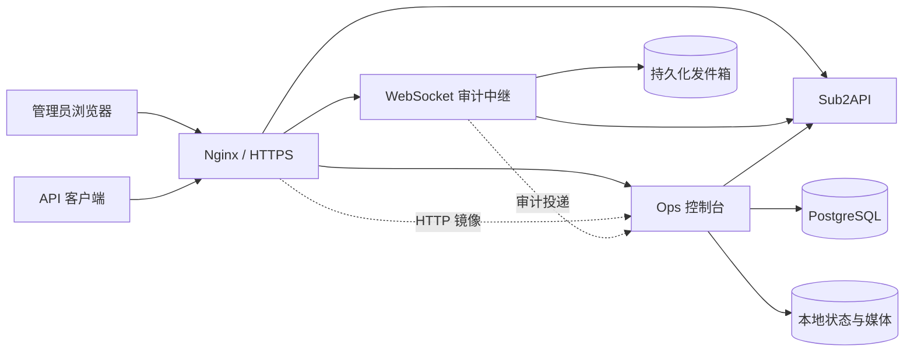

<div align="center">
  
  <h1>Sub2API Ops</h1>
  <p>独立的 Sub2API 运维控制台：额度自动化、用量分析、输入审计。</p>
  <p>
    <a href="https://github.com/919101797/sub2api-ops/actions/workflows/ci.yml"></a>
    <a href="docs/development/setup.md">开始开发</a> ·
    <a href="docs/operations/deployment.md">部署</a> ·
    <a href="docs/README.md">文档</a> ·
    <a href="CONTRIBUTING.md">参与贡献</a>
  </p>
</div>

Ops 作为独立服务接入已有 Sub2API，复用它的管理员身份、管理 API 和 PostgreSQL。它负责让额度变化、分配结果和审计记录可观察、可复核，不修改 Sub2API 镜像，也不重置 OpenAI 上游额度。本项目由社区独立维护，不是 Sub2API 官方组件。

## 能做什么

| 能力 | 说明 |
| --- | --- |
| 管理员登录 | 密码、TOTP，以及上游已配置的 GitHub / Google OAuth；仅允许启用中的管理员 |
| 周期重置 | 识别上游周期变化，按进度重置关联订阅，重启后可续跑 |
| 容量同步 | 根据用量估算周期容量，扣除账号预留后按份额更新分组周限 |
| 用户峰谷策略 | 按时区、工作日和时间窗口调整用户并发与 RPM，支持豁免用户 |
| 用量分析 | 账号、用户、模型、缓存、成本与延迟维度的统计 |
| 输入审计 | HTTP 采集、WebSocket 中继、会话关联、受限媒体存储与留存清理 |
| 运维界面 | 九套交互场景、明暗模式、移动布局，以及减弱动态效果支持 |

技术栈：Node.js 24 LTS、Fastify、React 19、TypeScript、Vite、Vitest、PostgreSQL、Docker Compose。

## 开始使用

**前置条件：Node.js 24.15+（24 LTS）、npm、已有的 Sub2API 及其 PostgreSQL。** 审计会访问上游 `content_moderation_logs` 等表，并要求创建自己的 `sub2api_ops` schema；空数据库无法替代完整的 Sub2API 环境。先按[数据库准备](docs/operations/deployment.md#数据库准备)完成授权。

```bash
git clone https://github.com/919101797/sub2api-ops.git
cd sub2api-ops
npm ci
cp -n .env.development.example .env
cp -n config.example.json config.json
chmod 600 .env config.json
```

填写 `.env` 中的上游地址、管理员 API Key、两组数据库凭据及密钥；[配置参考](docs/operations/configuration.md)逐项说明。开发模板使用 Sub2API `8081`、Ops API `8080`、前端 `5173`。分别生成会话密钥和采集密钥，填入 `SESSION_KEY_BASE64` 与 `PROMPT_CAPTURE_SECRET`：

```bash
node -e "console.log(require('node:crypto').randomBytes(32).toString('base64'))"
node -e "console.log(require('node:crypto').randomBytes(32).toString('hex'))"
NODE_OPTIONS='--env-file=.env' npm run dev
```

访问 <http://localhost:5173/ops/>，使用 **Sub2API 管理员账号**登录。没有内置管理员密码。`config.example.json` 的账号和用户峰谷策略默认关闭；配置真实账号、分组并确认分配参数后再启用。Windows PowerShell 命令见[开发指南](docs/development/setup.md)。

只做源码开发与自动化测试时，无需数据库或生产凭据：

```bash
npm ci
npm run typecheck
npm test
npm run build
```

完整部署需要自备 Sub2API、PostgreSQL、Docker 网络和 HTTPS 反向代理，仓库不包含这些外部服务的镜像或数据。生产镜像在开发机或 CI 构建，服务器仅加载并以 `--no-build` 启动，详见[部署指南](docs/operations/deployment.md)。

## 架构



架构、API 边界与故障语义见[系统架构](docs/system/architecture.md)。上游接口要求见[集成契约](docs/system/integration.md)；当前没有针对全部 Sub2API 版本的兼容性保证。

## 文档导航

| 我要做什么 | 文档 |
| --- | --- |
| 理解产品范围与设计 | [产品定义](docs/product/product.md) · [设计系统](docs/product/design-system.md) |
| 本地启动、调试、改代码 | [开发指南](docs/development/setup.md) · [测试指南](docs/development/testing.md) |
| 配置、部署、升级与排障 | [配置参考](docs/operations/configuration.md) · [部署](docs/operations/deployment.md) · [故障排查](docs/operations/troubleshooting.md) |
| 查看功能行为与验收场景 | [功能规格索引](docs/specs/README.md) |
| 反馈问题或贡献 | [贡献指南](CONTRIBUTING.md) · [支持方式](SUPPORT.md) · [安全政策](SECURITY.md) |
| 查看公开版本变化 | [更新日志](CHANGELOG.md) |

示例账号、邮箱与 IP 均为虚构数据；仓库不含真实配置、运行数据或原部署历史。问题反馈和 PR 也请继续使用脱敏信息。

## 许可证与致谢

本项目原创代码采用 [MIT](LICENSE)。**第三方代码和素材保留各自许可证，不因根目录 MIT 许可证而重新授权。** 特别是 React Bits 的 Ferrofluid / Light Tunnel 使用 MIT + Commons Clause，包含组件自身销售、再许可和再分发限制；使用或再分发前请阅读[第三方声明](THIRD_PARTY_NOTICES.md)与[原许可文本](LICENSES/React-Bits.txt)。

感谢 Sub2API、React Bits、OGL、Motion 及相关依赖作者；NASA 天体影像与生成素材来源也列于第三方声明。
